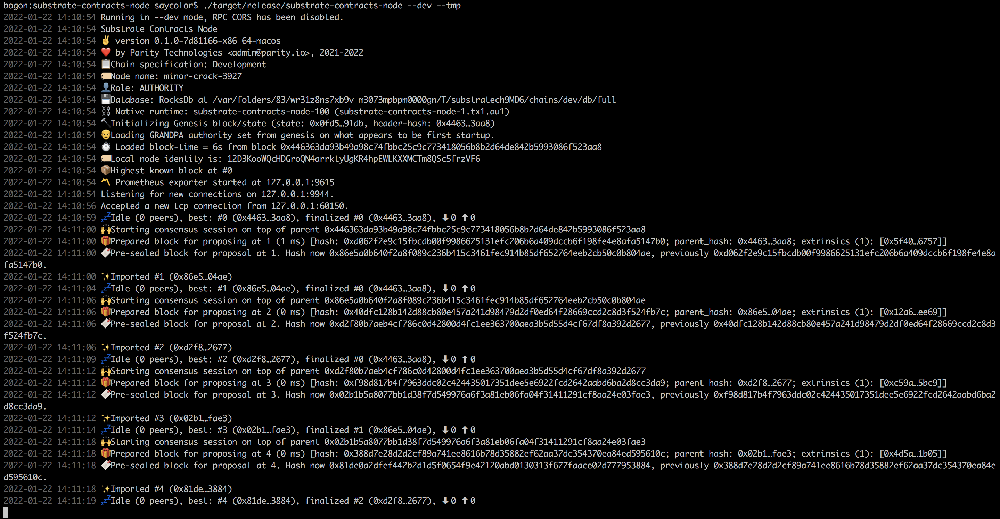

# substrate-contracts-ink-erc20  
### substrate-contracts-node 
1) 基于substrate 4.0的智能合约节点，加入ChainExtension

2) 后台运行效果:  

 

3) 可视化查看:

 


### contracts_ink_erc20  
1) 基于ink的erc20智能合约

2) cargo test 单元测试结果:

 

3) 可视化调用 canvas ui链接: 

```
https://paritytech.github.io/canvas-ui/#/instantiate  
```
4) 上传合约文件,部署合约:

 

5) 合约部署完成:


6) 调用合约，查询总供应量:


7) 调用合约，转移资产:


8) 转移成功,查询转移地址账户资产:


8) 可视化查看链上链接:

```
https://polkadot.js.org/apps/#/explorer
```

9) 查看链上状态和事件:


